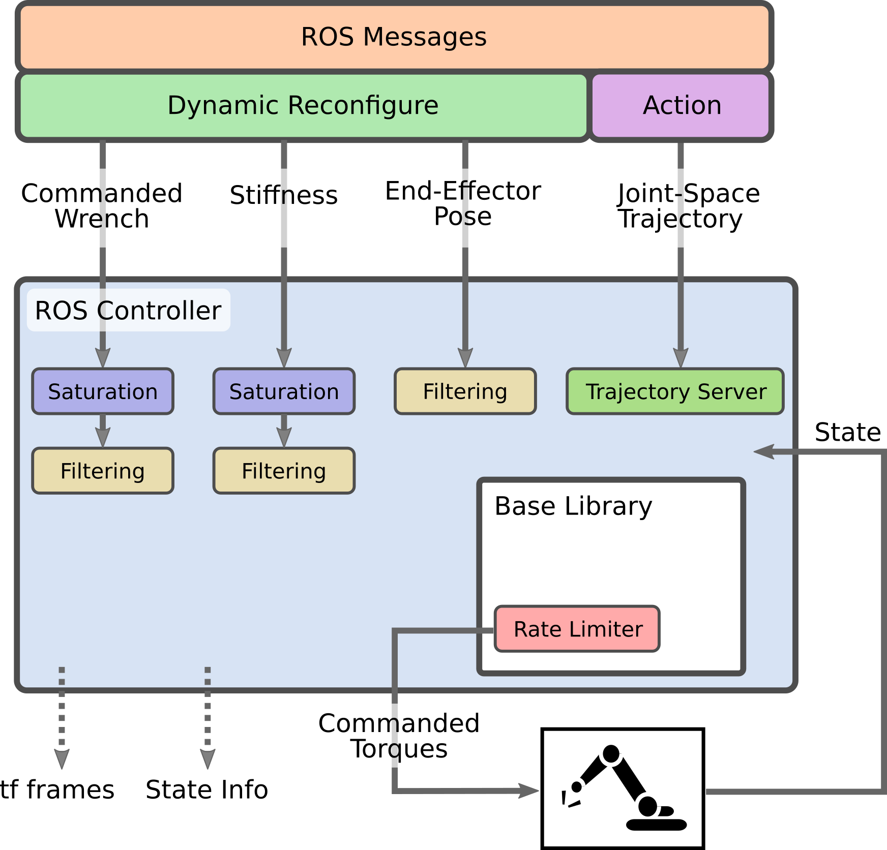

# Cartesian Impedance Controller
[](https://github.com/matthias-mayr/Cartesian-Impedance-Controller/actions/workflows/build_code.yml)  [](https://matthias-mayr.github.io/Cartesian-Impedance-Controller/)
## Description
This project is an implementation of Cartesian impedance control for robotic manipulators. It is a type of control strategy that sets a dynamic relationship between contact forces and the position of a robot arm, making it suitable for collaborative robots. It is particularily useful when the interesting dimensions in the workspace are in the Cartesian space.

The controller is developed using the seven degree-of-freedom (DoF) robot arm `LBR iiwa` by `KUKA AG` and has also been tested with the `Franka Emika Robot (Panda)` both in reality and simulation.

The implementation consists of a
1. base library that has few dependencies and can e.g. be directly integrated into software such as the DART simulator and a
2. ROS control integration on top of it.

### Short Pitch at ROSCon:
[](http://www.youtube.com/watch?v=Q4aPm4O_9fY "Cartesian Impedance Controller ROSCon 2022 Lightning Talk")

http://www.youtube.com/watch?v=Q4aPm4O_9fY

## Features

- Configurable stiffness values along all Cartesian dimensions at runtime
- Configurable damping factors along all Cartesian dimensions at runtime
- Change reference pose at runtime
- Apply Cartesian forces and torques at runtime
- Optional filtering of stiffnesses, pose and wrenches for smoother operation
- Handling of joint trajectories with nullspace configurations, e.g. from MoveIt
- Jerk limitation
- Separate base library that can be integrated in non-ROS environments
- Interface to ROS messages and dynamic_reconfigure for easy runtime configuration



## Torques

The torque signal commanded to the joints of the robot is composed by the superposition of three joint-torque signals:
- The torque calculated for Cartesian impedance control with respect to a Cartesian pose reference in the frame of the EE of the robot (`tau_task`).
- The torque calculated for joint impedance control with respect to a desired configuration and projected in the nullspace of the robot's Jacobian, so it should not affect the Cartesian motion of the robot's end-effector (`tau_ns`).
- The torque necessary to achieve the desired external force command (`cartesian_wrench`), in the frame of the EE of the robot (`tau_ext`).

## Limitations

- Joint friction is not accounted for
- Stiffness and damping values along the Cartesian dimensions are uncoupled
- No built-in gravity compensation for tools or workpieces (can be achieved by commanding a wrench)

## Prerequisites
### Required
- [Eigen](https://eigen.tuxfamily.org/index.php?title=Main_Page)

### ROS Controller
We use `RBDyn` to calculate forward kinematics and the Jacobian.

- [ROS](https://www.ros.org/)
- [RBDyn](https://github.com/jrl-umi3218/RBDyn)
- [mc_rbdyn_urdf](https://github.com/jrl-umi3218/mc_rbdyn_urdf)
- [SpaceVecAlg](https://github.com/jrl-umi3218/SpaceVecAlg)

The installation steps for the installation of the non-ROS dependencies are automated in `scripts/install_dependencies.sh`.

## Controller Usage in ROS
Assuming that there is an [initialized catkin workspace](https://catkin-tools.readthedocs.io/en/latest/quick_start.html#initializing-a-new-workspace) you can clone this repository, install the dependencies and compile the controller.

Here are the steps:

```bash
cd catkin_ws
git clone https://github.com/matthias-mayr/Cartesian-Impedance-Controller src/Cartesian-Impedance-Controller
src/Cartesian-Impedance-Controller/scripts/install_dependencies.sh
rosdep install --from-paths src --ignore-src --rosdistro=${ROS_DISTRO} -y
catkin build # or catkin_make
source devel/setup.bash
```

This allows you to add a controller configuration for the controller type `cartesian_impedance_controller/CartesianImpedanceController` in your `ros_control` configuration.

### Configuration file
When using the controller it is a good practice to describe the parameters in a `YAML` file and load it. Usually this is already done by your robot setup - e.g. for [iiwa_ros](https://github.com/epfl-lasa/iiwa_ros/) that is [here](https://github.com/epfl-lasa/iiwa_ros/blob/master/iiwa_control/config/iiwa_control.yaml).
Here is a template of what needs to be in that YAML file that can be adapted:
```YAML
CartesianImpedance_trajectory_controller:
  type: cartesian_impedance_controller/CartesianImpedanceController
  joints:                               # Joints to control
    - iiwa_joint_1
    - iiwa_joint_2
    - iiwa_joint_3
    - iiwa_joint_4
    - iiwa_joint_5
    - iiwa_joint_6
    - iiwa_joint_7
  end_effector: iiwa_link_ee            # Link to control arm in
  update_frequency: 500                 # Controller update frequency in Hz
  # Optional parameters - the mentioned values are the defaults
  dynamic_reconfigure: true             # Starts dynamic reconfigure server
  handle_trajectories: true             # Accept traj., e.g. from MoveIt
  robot_description: /robot_description # In case of a varying name
  wrench_ee_frame: iiwa_link_ee         # Default frame for wrench commands
  delta_tau_max: 1.0                    # Max. commanded torque diff between steps in Nm
  filtering:                            # Update existing values (0.0 1.0] per s
    nullspace_config: 0.1               # Nullspace configuration filtering
    pose: 0.1                           # Reference pose filtering
    stiffness: 0.1                      # Cartesian and nullspace stiffness
    wrench: 0.1                         # Commanded torque
  verbosity:
    verbose_print: false                # Enables additional prints
    state_msgs: false                   # Messages of controller state
    tf_frames: false                    # Extra tf frames
```

### Startup

To start up with this controller, eventually the controller spawner needs to load the controller. Typically this is baked into the robot driver. For example if using the YAML example above, with [iiwa_ros](https://github.com/epfl-lasa/iiwa_ros/), this can be achieved with command:

```bash
roslaunch iiwa_gazebo iiwa_gazebo.launch controller:=CartesianImpedance_trajectory_controller
```

### Changing parameters with Dynamic Reconfigure
If it is not deactivated, the controller can be configured with [dynamic_reconfigure](http://wiki.ros.org/dynamic_reconfigure) both with [command line tools](http://wiki.ros.org/dynamic_reconfigure#dynamic_reconfigure.2Fgroovy.dynparam_command-line_tool) as well as the graphical user interface [rqt_reconfigure](http://wiki.ros.org/rqt_reconfigure). To start the latter you can run:
```bash
rosrun rqt_reconfigure rqt_reconfigure
```

There are several entries:
- `cartesian_wrench_reconfigure`
- `damping_factors_reconfigure`
- `stiffness_reconfigure`

For applying wrench, the `apply` checkbox needs to be ticked for the values to be used. Damping and stiffness changes are only updated when the `update` checkbox is ticked, allowing to configure changes before applying them. Note that the end-effector reference pose can not be set since it usually should follow a smooth trajectory.

### Changing parameters with ROS messages
In addition to the configuration with `dynamic_reconfigure`, the controller configuration can always be adapted by sending ROS messages. Outside prototyping this is the main way to parameterize it.

The instructions below use `${controller_ns}` for the namespace of your controller. This can for example be `/cartesian_impedance_controller`. If you want to copy the example commands 1:1, you can set an environment variable with `export controller_ns=/<your_namespace>`.

#### End-effector reference pose
New reference poses can be sent to the topic `${controller_ns}/reference_pose`. They are expected to be in the root frame of the robot description which is often `world`. The root frame can be obtained from the parameter server with `rosparam get ${controller_ns}/root_frame`.

To send a new reference pose 0.6m above the root frame pointing into the z-direction of it, execute this:

```bash
rostopic pub --once /${controller_ns}/reference_pose geometry_msgs/PoseStamped "header:
  seq: 0
  stamp:
    secs: 0
    nsecs: 0
  frame_id: ''
pose:
  position:
    x: 0.0
    y: 0.0
    z: 0.6
  orientation:
    x: 0.0
    y: 0.0
    z: 0.0
    w: 1.0"
```

Most often one wants to have a controlled way to set reference poses. Once can for example use a [trajectory generator for Cartesian trajectories](https://git.cs.lth.se/robotlab/cartesian_trajectory_generator).

#### Cartesian Stiffness

In order to set only the Cartesian stiffnesses, once can send a `geometry_msgs/WrenchStamped` to `set_cartesian_stiffness`:

```bash
rostopic pub --once /${controller_ns}/set_cartesian_stiffness geometry_msgs/WrenchStamped "header:
  seq: 0
  stamp:
    secs: 0
    nsecs: 0
  frame_id: ''
wrench:
  force:
    x: 300.0
    y: 300.0
    z: 300.0
  torque:
    x: 30.0
    y: 30.0
    z: 30.0"
```

#### Cartesian Damping factors

The damping factors can be configured with a `geometry_msgs/WrenchStamped` msg similar to the stiffnesses to the topic `${controller_ns}/set_damping_factors`. Damping factors are in the interval [0.01,2]. These damping factors are additionally applied to the damping rule which is `2*sqrt(stiffness)`.

#### Stiffnesses, damping and nullspace at once
When also setting the nullspace stiffnes, a custom messages of the type `cartesian_impedance_controller/ControllerConfig` is to be sent to `set_config`:

```bash
rostopic pub --once /${controller_ns}/set_config cartesian_impedance_controller/ControllerConfig "cartesian_stiffness:
  force: {x: 300.0, y: 300.0, z: 300.0}
  torque: {x: 30.0, y: 30.0, z: 30.0}
cartesian_damping_factors:
  force: {x: 1.0, y: 1.0, z: 1.0}
  torque: {x: 1.0, y: 1.0, z: 1.0}
nullspace_stiffness: 10.0
nullspace_damping_factor: 0.1
q_d_nullspace: [0, 0, 0, 0, 0, 0, 0]" 
```

`q_d_nullspace` is the nullspace joint configuration, so the joint configuration that should be achieved if the nullspace allows it. Note that the end-effector pose would deviate if the forward kinematics of this joint configuration do not overlap with it.

#### Cartesian Wrenches

A Cartesian wrench can be commanded by sending a `geometry_msgs/WrenchStamped` to the topic `${controller_ns}/set_cartesian_wrench`.
Internally the wrenches are applied in the root frame. Therefore wrench messages are transformed into the root frame using `tf`.<br>
**Note:** An empty field `frame_id` is interpreted as end-effector frame since this is the most applicable one when working with a manipulator.<br>
**Note:** The wrenches are transformed into the root frame when they arrive, but not after that. E.g. end-effector wrenches might need to get updated.

```bash
rostopic pub --once /${controller_ns}/set_cartesian_wrench geometry_msgs/WrenchStamped "header:
  seq: 0
  stamp:
    secs: 0
    nsecs: 0
  frame_id: ''
wrench:
  force:
    x: 0.0
    y: 0.0
    z: 5.0
  torque:
    x: 0.0
    y: 0.0
    z: 0.0"
```

### Trajectories and MoveIt

If `handle_trajectories` is not disabled, the controller can also execute trajectories. An action server is spun up at `${controller_ns}/follow_joint_trajectory` and a fire-and-forget topic for the message type `trajectory_msgs/JointTrajectory` is at `${controller_ns}/joint_trajectory`.

In order to use it with `MoveIt` its controller configuration ([example in iiwa_ros](https://github.com/epfl-lasa/iiwa_ros/blob/master/iiwa_moveit/config/EffortJointInterface_controllers.yaml)) needs to look somewhat like this:
```yaml
controller_list:
  - name: ${controller_ns}
    action_ns: follow_joint_trajectory
    type: FollowJointTrajectory
    default: true
    joints:
      - iiwa_joint_1
      - iiwa_joint_2
      - iiwa_joint_3
      - iiwa_joint_4
      - iiwa_joint_5
      - iiwa_joint_6
      - iiwa_joint_7
```

**Note:** A nullspace stiffness needs to be specified so that the arm also follows the joint configuration and not just the end-effector pose.

## Safety
We have used the controller with Cartesian translational stiffnesses of up to 1000 N/m and experienced it as very stable. It is also stable in singularities.

One additional measure can be to limit the maximum joint torques that can be applied by the robot arm in the URDF. On our KUKA iiwas we limit the maximum torque of each joint to 20 Nm, which allows a human operator to easily interfere at any time just by grabbing the arm and moving it.

When using `iiwa_ros`, these limits can be applied [here](https://github.com/epfl-lasa/iiwa_ros/blob/master/iiwa_description/urdf/iiwa7.xacro#L53-L59). For the Panda they are applied [here](https://github.com/frankaemika/franka_ros/blob/develop/franka_description/robots/panda/joint_limits.yaml#L6). Both arms automatically apply gravity compensation, the limits are only used for the task-level torques on top of that.

## Documentation
The source code comes with Doxygen documentation. In a `catkin` workspace it can be built with:
```bash
sudo apt-get install ros-$ROS_DISTRO-rosdoc-lite
roscd cartesian_impedance_controller
rosdoc_lite .
```
It can then be found in the `doc` folder with `doc/html/index.html` being the entry point.

The documentation for the public Github repository is automatically built and is deployed at:<br>
https://matthias-mayr.github.io/Cartesian-Impedance-Controller/

## Repository and Contributions
The main public code repository is at: https://github.com/matthias-mayr/Cartesian-Impedance-Controller

Issues, questions and pull requests are welcome. Feel free to contact the main author at `firstname.lastname@cs.lth.se` if you are using this implementation.

## Citing this Work
A brief paper about the features and the control theory is under submission at [JOSS](https://joss.theoj.org/). For now there is a [preprint on arXiv](https://arxiv.org/abs/2212.11215).<br>
If you are using it or interacting with it, we would be happy if you could cite it.
```bibtex
@misc{https://doi.org/10.48550/arxiv.2212.11215,
  doi = {10.48550/ARXIV.2212.11215},
  url = {https://arxiv.org/abs/2212.11215},
  author = {Mayr, Matthias and Salt-Ducaju, Julian M.},
  keywords = {Robotics (cs.RO), FOS: Computer and information sciences, FOS: Computer and information sciences},
  title = {A C++ Implementation of a Cartesian Impedance Controller for Robotic Manipulators},
  publisher = {arXiv},
  year = {2022}, 
  copyright = {Creative Commons Attribution Share Alike 4.0 International}
}
```

## Troubleshooting
### Compilation - A required package was not found

catkin build shows this CMake Error:
```
CMake Error at /usr/share/cmake-3.16/Modules/FindPkgConfig.cmake:463 (message):
  A required package was not found
Call Stack (most recent call first):
  /usr/share/cmake-3.16/Modules/FindPkgConfig.cmake:643 (_pkg_check_modules_internal)
  CMakeLists.txt:12 (pkg_check_modules)
```

There are missing dependencies. When replacing `catkin_ws` with your workspace, they can be resolved like this :
```
cd catkin_ws
src/cartesian_impedance_controller/scripts/install_dependencies.sh
rosdep install --from-paths src --ignore-src --rosdistro=${ROS_DISTRO} -y
```

### RBDyn Library not found

When starting the controller, this message appears:
```
 [ControllerManager::loadController]: Could not load class 'cartesian_impedance_controller/CartesianImpedanceController': Failed to load library /home/matthias/catkin_ws/devel/lib//libcartesian_impedance_controller_ros.so. Make sure that you are calling the PLUGINLIB_EXPORT_CLASS macro in the library code, and that names are consistent between this macro and your XML. Error string: Could not load library (Pocoexception = libRBDyn.so.1: cannot open shared object file: No such file or directory) /gazebo: [ControllerManager::loadController]: Could not load controller 'CartesianImpedance_trajectory_controller' because controller type 'cartesian_impedance_controller/CartesianImpedanceController' does exist.
 ```

 This happens when a shared library can not be found. They are installed with `scripts/install_dependencies.sh`. The dynamic linker has a cache and we now manually update it by calling `ldconfig` after the installation.

 ### Controller crashes

 Most likely this happens because some parts of the stack like `iiwa_ros` or `RBDyn` were built with `SIMD`/`march=native` being turned on and other parts are not. Everything needs to be built with or without this option in order to have working alignment. This package builds without, because it is otherwise cumbersome for people to ensure that this happens across the whole stack.