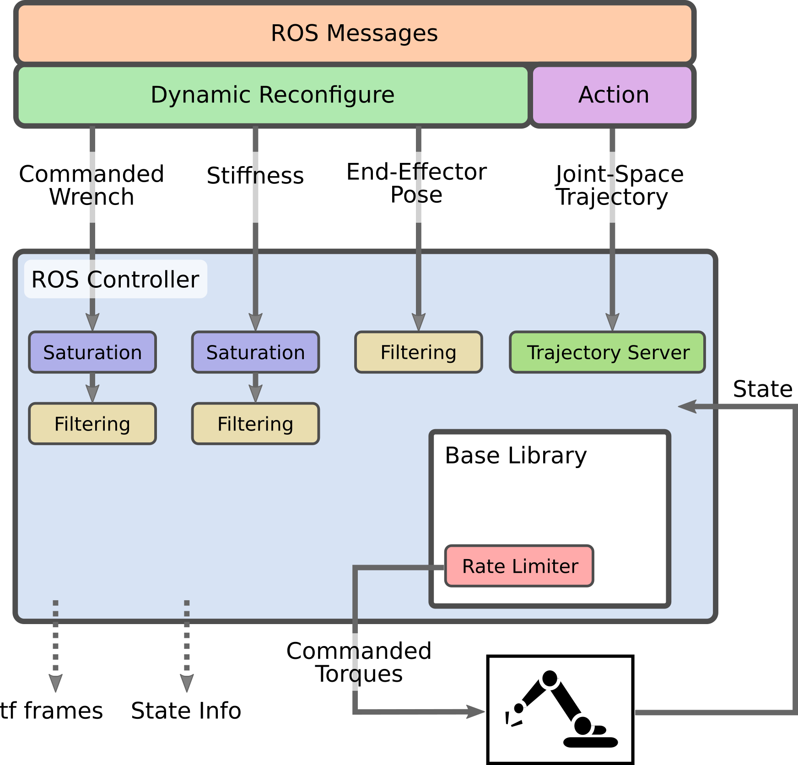

# Cartesian Impedance Controller
[](https://github.com/matthias-mayr/Cartesian-Impedance-Controller/actions/workflows/build_code.yml)
[](https://doi.org/10.21105/joss.05194)
[](https://opensource.org/licenses/BSD-3-Clause)
 
## Description

This project is an implementation of Cartesian impedance control for robotic manipulators. It is a type of control strategy that sets a dynamic relationship between contact forces and the position of a robot arm, making it suitable for collaborative robots. It is particularly useful when the interesting dimensions in the workspace are in the Cartesian space.
 
In ROS 2 this controller is known to be deployed on `Franka Emika Research 3` with [franka_ros](https://github.com/frankarobotics/franka_ros) and `KUKA iiwa7` robots with [lbr_fri_ros2_stack](https://github.com/lbr-stack/lbr_fri_ros2_stack) both in reality and simulation. In ROS 1 it was also used with the `Franka Emika Robot (Panda)` using [franka_ros](https://github.com/frankarobotics/franka_ros/tree/noetic-devel) and `KUKA iiwa7` with [iiwa_ros](https://github.com/epfl-lasa/iiwa_ros).
 
The implementation consists of a
1. base library that has few dependencies and can e.g. be directly integrated into software such as the DART simulator or any simulator which has `ros2_control` interface
2. ROS 2 control integration on top of it.
 
### Short Pitch at ROSCon:
[](https://www.youtube.com/watch?v=YtnQLyA7_og "Cartesian Impedance Controller ROSCon 2022 Lightning Talk")
 
https://www.youtube.com/watch?v=YtnQLyA7_og
 
## Features
 
- Configurable stiffness values along all Cartesian dimensions at runtime
- Configurable damping factors along all Cartesian dimensions at runtime
- Change reference pose at runtime
- Apply Cartesian forces and torques at runtime
- Optional filtering of stiffnesses, pose and wrenches for smoother operation
- Handling of joint trajectories with nullspace configurations, e.g. from MoveIt
- Jerk limitation
- Separate base library that can be integrated in non-ROS environments
- Interface to ROS messages and dynamic_reconfigure for easy runtime configuration
 

 
## Torques
 
The torque signal commanded to the joints of the robot is composed by the superposition of three joint-torque signals:
- The torque calculated for Cartesian impedance control with respect to a Cartesian pose reference in the frame of the EE of the robot (`tau_task`).
- The torque calculated for joint impedance control with respect to a desired configuration and projected in the nullspace of the robot's Jacobian, so it should not affect the Cartesian motion of the robot's end-effector (`tau_ns`).
- The torque necessary to achieve the desired external force command (`cartesian_wrench`), in the frame of the EE of the robot (`tau_ext`).
 
## Limitations
 
- Joint friction is not accounted for
- Stiffness and damping values along the Cartesian dimensions are uncoupled
- No built-in gravity compensation for tools or workpieces (can be achieved by commanding a wrench)
 
## Prerequisites
### Required
- [Eigen](https://eigen.tuxfamily.org/index.php?title=Main_Page)
 
### ROS Controller
We use `RBDyn` to calculate forward kinematics and the Jacobian.

- [ROS](https://www.ros.org/)
- [RBDyn](https://github.com/jrl-umi3218/RBDyn)
- [mc_rbdyn_urdf](https://github.com/jrl-umi3218/mc_rbdyn_urdf)
- [SpaceVecAlg](https://github.com/jrl-umi3218/SpaceVecAlg)

The installation steps for the installation of the non-ROS dependencies are automated in `scripts/install_dependencies.sh`.
 
## Controller Usage in ROS 2
Assuming that there is an initialized colcon workspace you can clone this repository, install the dependencies and compile the controller.
 
Here are the steps:

### Local Machine Installation
```bash
mkdir -p ~/ros2_ws/src  
cd ~/ros2_ws
git clone https://github.com/matthias-mayr/Cartesian-Impedance-Controller src/Cartesian-Impedance-Controller
bash src/Cartesian-Impedance-Controller/scripts/install_dependencies.sh
rosdep install --from-paths src --ignore-src --rosdistro=${ROS_DISTRO} -y
colcon build
source install/setup.bash
```
### Docker Installation

To build and run the Docker container for the Cartesian Impedance Controller, follow these steps:

#### Build the Docker Image
1. Navigate to the directory containing the `Dockerfile`.
2. Build the Docker image:
  ```bash
  docker build -t cartesian_impedance_controller:latest .
  ```

#### Run the Docker Container
1. Start a container from the built image:
  ```bash
  docker run -it --rm \
     --name cartesian_impedance_controller \
     --net=host \
     -e DISPLAY=$DISPLAY \
     -v /tmp/.X11-unix:/tmp/.X11-unix \
     cartesian_impedance_controller:latest
  ```

  - `--net=host`: Allows the container to use the host network.
  - `-e DISPLAY=$DISPLAY` and `-v /tmp/.X11-unix:/tmp/.X11-unix`: Enable GUI applications (e.g., `rviz2`) to run inside the container.

#### Optional: Enable Franka ROS 2 Integration
If you want to include Franka ROS 2 installation inside docker, build the docker image with the `BUILD_FRANKA_ROS` argument set to `true`:
```bash
docker build --build-arg BUILD_FRANKA_ROS=true -t cartesian_impedance_controller:franka .
```

### Access the Workspace
Once inside the container, you can access the ROS 2 workspace at `/ros2_ws`. To build the workspace or source it:
```bash
source /opt/ros/humble/setup.bash
cd /ros2_ws
colcon build
source install/setup.bash
```

This allows you to add a controller configuration for the controller type `cartesian_impedance_controller/CartesianImpedanceController` in your `ros2_control` configuration.
 
### Configuration file
When using the controller it is a good practice to describe the parameters in a `YAML` file and load it. Usually this is already done by your robot setup - e.g. for iiwa_ros that is here.
Here is a template of what needs to be in that YAML file that can be adapted:
```YAML
cartesian_impedance_controller:
  ros__parameters:
   type: cartesian_impedance_controller/CartesianImpedanceController
   joints:
     - fr3_joint1
     - fr3_joint2
     - fr3_joint3
     - fr3_joint4
     - fr3_joint5
     - fr3_joint6
     - fr3_joint7
   end_effector: fr3_hand_tcp
   update_frequency: 500
   handle_trajectories: true
   robot_description: "robot_description"
   wrench_ee_frame: fr3_hand_tcp
   delta_tau_max: 1.0
 
   damping:
     translation:
       x: 1.0
       y: 1.0
       z: 1.0
     rotation:
       x: 1.0
       y: 1.0
       z: 1.0
     nullspace_damping: 1.0
     update_damping_factors: false
 
   stiffness:
     translation:
       x: 200.0
       y: 200.0
       z: 200.0
     rotation:
       x: 20.0
       y: 20.0
       z: 20.0
     nullspace_stiffness: 0.0
     update_stiffness: false
 
   wrench:
     apply_wrench: false
     force_x: 0.0
     force_y: 0.0
     force_z: 0.0
     torque_x: 0.0
     torque_y: 0.0
     torque_z: 0.0
 
   filtering:
     nullspace_config: 0.1
     pose: 0.1
     stiffness: 0.1
     wrench: 0.1
 
   verbosity:
     verbose_print: false
     state_msgs: true
     tf_frames: false
```
 
### Changing parameters with Dynamic Reconfigure
The controller can be configured with dynamic_reconfigure both with command line tools as well as the graphical user interface rqt_reconfigure. To start the latter you can run:
```bash
ros2 run rqt_reconfigure rqt_reconfigure
```
For applying wrench, the `apply` checkbox needs to be ticked for the values to be used. Damping and stiffness changes are only updated when the `update` checkbox is ticked, allowing to configure changes before applying them. Note that the end-effector reference pose can not be set since it usually should follow a smooth trajectory.
 
### Changing parameters with ROS messages
In addition to the configuration with `dynamic_reconfigure`, the controller configuration can always be adapted by sending ROS messages. Outside prototyping this is the main way to parameterize it.
 
 
#### Cartesian Stiffness
 
In order to set only the Cartesian stiffnesses, once can send a `geometry_msgs/msgs/WrenchStamped` to `set_cartesian_stiffness`:
 
```bash
ros2 topic pub --once /set_cartesian_stiffness geometry_msgs/msg/WrenchStamped "header:
  stamp:
    sec: 0
    nanosec: 0
  frame_id: ''
wrench:
  force:
    x: 300.0
    y: 300.0
    z: 300.0
  torque:
    x: 30.0
    y: 30.0
    z: 30.0"
```
 
#### Cartesian Damping factors
 
The damping factors can be configured with a `geometry_msgs/msgs/WrenchStamped` msg similar to the stiffnesses to the topic `/set_damping_factors`. Damping factors are in the interval [0.01,2]. These damping factors are additionally applied to the damping rule which is `2*sqrt(stiffness)`.
 
#### Cartesian Wrenches
 
A Cartesian wrench can be commanded by sending a `geometry_msgs/msg/WrenchStamped` to the topic `/set_cartesian_wrench`.
Internally the wrenches are applied in the root frame. Therefore wrench messages are transformed into the root frame using `tf`.<br>
**Note:** An empty field `frame_id` is interpreted as end-effector frame since this is the most applicable one when working with a manipulator.<br>
**Note:** The wrenches are transformed into the root frame when they arrive, but not after that. E.g. end-effector wrenches might need to get updated.
 
```bash
ros2 topic pub --once /set_cartesian_wrench geometry_msgs/msg/WrenchStamped "header:
  stamp:
    sec: 0
    nanosec: 0
  frame_id: ''
wrench:
  force:
    x: 0.0
    y: 0.0
    z: 5.0
  torque:
    x: 0.0
    y: 0.0
    z: 0.0"
```
 
### Trajectories and MoveIt
 
The controller can also execute trajectories. An action server is spun up at `/follow_joint_trajectory` and a fire-and-forget topic for the message type `trajectory_msgs/msg/JointTrajectory` is at `/joint_trajectory`.
 
In order to use it with `MoveIt` its controller configuration ([example in iiwa_ros](https://github.com/epfl-lasa/iiwa_ros/blob/master/iiwa_moveit/config/EffortJointInterface_controllers.yaml)) needs to look somewhat like this:
```yaml
controller_list:
  - name: cartesian_impedance_controller
    action_ns: follow_joint_trajectory
    type: FollowJointTrajectory
    default: true
    joints:
      - fr3_joint1
      - fr3_joint2
      - fr3_joint3
      - fr3_joint4
      - fr3_joint5
      - fr3_joint6
      - fr3_joint7
```
 
**Note:** A nullspace stiffness needs to be specified so that the arm also follows the joint configuration and not just the end-effector pose.
 
## Safety (ROS 1 Version)
We have used the controller with Cartesian translational stiffnesses of up to 1000 N/m and experienced it as very stable. It is also stable in singularities.
 
One additional measure can be to limit the maximum joint torques that can be applied by the robot arm in the URDF. On our KUKA iiwas we limit the maximum torque of each joint to 20 Nm, which allows a human operator to easily interfere at any time just by grabbing the arm and moving it.
 
When using `iiwa_ros`, these limits can be applied [here](https://github.com/epfl-lasa/iiwa_ros/blob/master/iiwa_description/urdf/iiwa7.xacro#L53-L59). For the Panda they are applied [here](https://github.com/frankaemika/franka_ros/blob/develop/franka_description/robots/panda/joint_limits.yaml#L6). Both arms automatically apply gravity compensation, the limits are only used for the task-level torques on top of that.
 

## Citing this Work
A brief paper about the features and the control theory is accepted at [JOSS](https://joss.theoj.org/papers/10.21105/joss.05194).
If you are using it or interacting with it, we would appreciate a citation:
```
Mayr et al., (2024). A C++ Implementation of a Cartesian Impedance Controller for Robotic Manipulators. Journal of Open Source Software, 9(93), 5194, https://doi.org/10.21105/joss.05194
```
 
```bibtex
@article{mayr2024cartesian,
    doi = {10.21105/joss.05194},
    url = {https://doi.org/10.21105/joss.05194},
    year = {2024},
    publisher = {The Open Journal},
    volume = {9},
    number = {93},
    pages = {5194},
    author = {Matthias Mayr and Julian M. Salt-Ducaju},
    title = {A C++ Implementation of a Cartesian Impedance Controller for Robotic Manipulators}, journal = {Journal of Open Source Software}
}
```

## Testing

The `test/` directory contains three test suites. See [test/README.md](test/README.md) for more details.

| Test binary | Requires simulation | Description |
|---|---|---|
| `base_tests` | No | Unit tests for the base C++ library (stiffness, damping, filtering, …) |
| `ros_tests` | Yes | ROS 2 topic and parameter integration tests (replaces `ros.test`) |
| `ros_func_tests` | Yes | Functional controller tests (force application, motion tracking) |

### Quick start — base library unit tests (no simulation needed)

```bash
colcon build --packages-select cartesian_impedance_controller
colcon test  --packages-select cartesian_impedance_controller
colcon test-result --verbose
```

### Integration tests (simulation required)

Run the mock simulation that can not move the robot, but has a running controller and execute the tests on it:

```bash
ros2 launch cartesian_impedance_controller minimal_mock_simulation.launch.py 
./install/cartesian_impedance_controller/lib/cartesian_impedance_controller/ros_tests
./install/cartesian_impedance_controller/lib/cartesian_impedance_controller/ros_func_tests
```

## Troubleshooting
### Compilation - A required package was not found

colcon build shows this CMake Error:
```
CMake Error at CMakeLists.txt:50 (find_package):
  By not providing "FindRBDyn.cmake" in CMAKE_MODULE_PATH this project has
  asked CMake to find a package configuration file provided by "RBDyn", but
  CMake did not find one.

  Could not find a package configuration file provided by "RBDyn" with any of
  the following names:

    RBDynConfig.cmake
    rbdyn-config.cmake

  Add the installation prefix of "RBDyn" to CMAKE_PREFIX_PATH or set
  "RBDyn_DIR" to a directory containing one of the above files.  If "RBDyn"
  provides a separate development package or SDK, be sure it has been
  installed.
```

There are missing dependencies. When replacing `colcon_ws` with your workspace, they can be resolved like this :
```
cd colcon_ws
src/Cartesian-Impedance-Controller/scripts/install_dependencies.sh
rosdep install --from-paths src --ignore-src --rosdistro=${ROS_DISTRO} -y
```

### RBDyn Library not found

When starting the controller, this message appears:
```
 [ControllerManager::loadController]: Could not load class 'cartesian_impedance_controller/CartesianImpedanceController': Failed to load library /home/matthias/catkin_ws/devel/lib//libcartesian_impedance_controller_ros.so. Make sure that you are calling the PLUGINLIB_EXPORT_CLASS macro in the library code, and that names are consistent between this macro and your XML. Error string: Could not load library (Pocoexception = libRBDyn.so.1: cannot open shared object file: No such file or directory) /gazebo: [ControllerManager::loadController]: Could not load controller 'CartesianImpedance_trajectory_controller' because controller type 'cartesian_impedance_controller/CartesianImpedanceController' does exist.
 ```

 This happens when a shared library can not be found. They are installed with `scripts/install_dependencies.sh`. The dynamic linker has a cache and we now manually update it by calling `ldconfig` after the installation.

 ### Controller crashes

 Most likely this happens because some parts of the stack like `iiwa_ros` or `RBDyn` were built with `SIMD`/`march=native` being turned on and other parts are not. Everything needs to be built with or without this option in order to have working alignment. This package builds without, because it is otherwise cumbersome for people to ensure that this happens across the whole stack.
